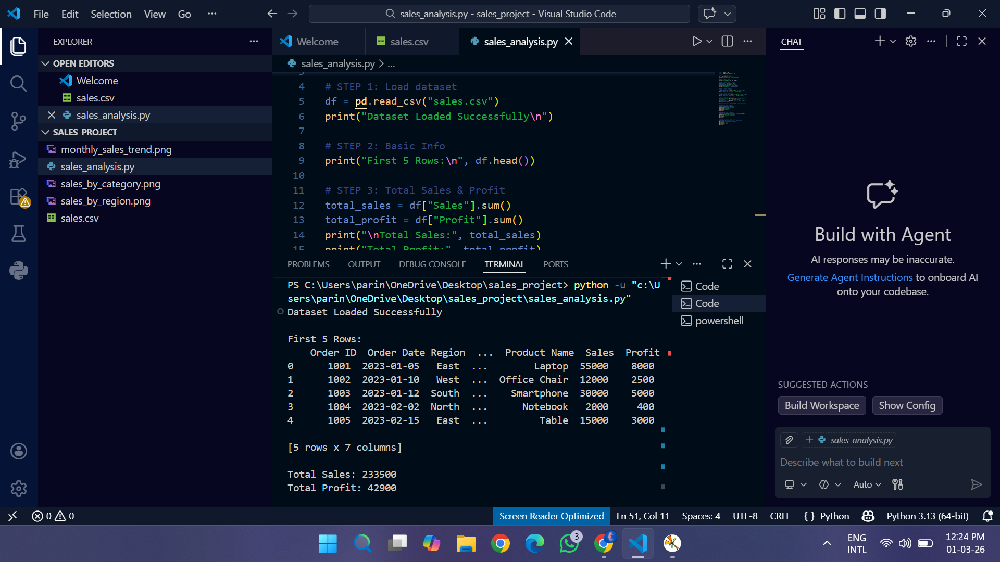
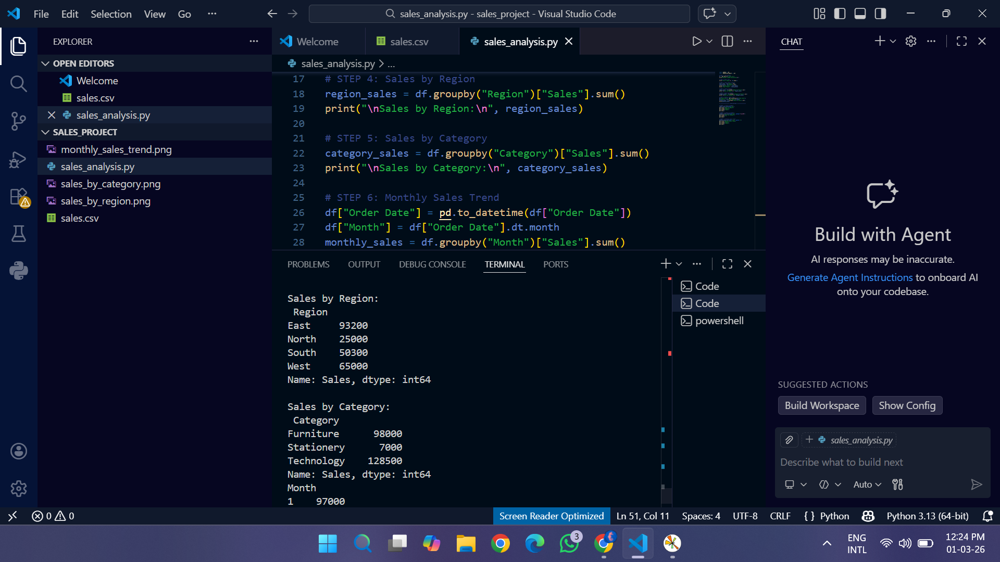
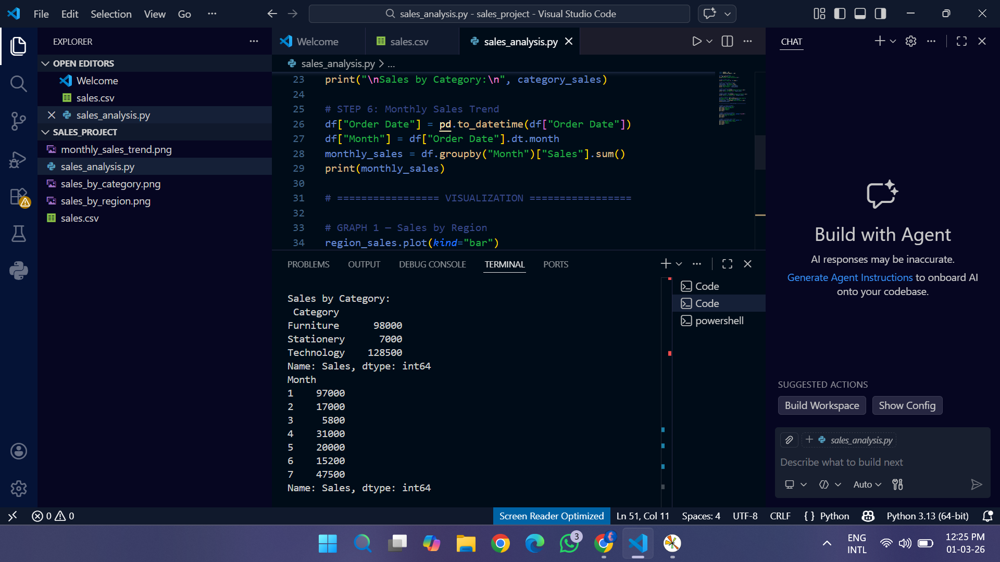

# 📊 Sales Data Analysis Project

## 📌 Project Overview

This project performs **Sales Data Analysis** using Python. It analyzes sales performance, customer trends, and product insights using **Pandas** for data processing and **Matplotlib** for visualization.

The goal of this project is to demonstrate real-world **data analysis skills** suitable for a resume or portfolio.

## 🎯 Objectives

* Clean and preprocess raw sales data
* Perform exploratory data analysis (EDA)
* Identify top-performing products and regions
* Analyze monthly sales trends
* Visualize insights using charts

## 🛠️ Technologies Used

* **Python**
* **Pandas** – Data analysis
* **Matplotlib** – Data visualization
* **NumPy** – Numerical operations
* **VS Code**
* 
## 📂 Dataset Features

The dataset contains:
* Order Date
* Product Name
* Category
* Sales Amount
* Quantity
* Region

## 📈 Analysis Performed

### ✔ Data Cleaning
* Converted dates to datetime format
* Removed missing values
* Fixed data types

### ✔ Sales Insights
* Total Sales Calculation
* Top Selling Products
* Sales by Region
* Category-wise Sales

### ✔ Trend Analysis
* Monthly Sales Trend
* Sales Distribution Visualization

## 📊 Sample Visualizations

* Bar Chart → Top Products
* Line Chart → Monthly Sales Trend
* Pie Chart → Regional Sales Distribution

---

## ▶️ How to Run This Project

1️⃣ Clone the repository
git clone https://github.com/parinetha08/Sales-Data-analysis.git

2️⃣ Install required libraries
pip install pandas matplotlib numpy

3️⃣ Run the notebook/script
python sales_analysis.py

## 💡 Key Skills Demonstrated

* Data Cleaning
* Data Visualization
* Exploratory Data Analysis
* Python Programming
* Business Insight Generation

## 👩‍💻 Author

**Parinetha Vuppalapu**
AI Engineering Student

## ⭐ If you like this project

Give it a ⭐ on GitHub!

---

## Project Output

